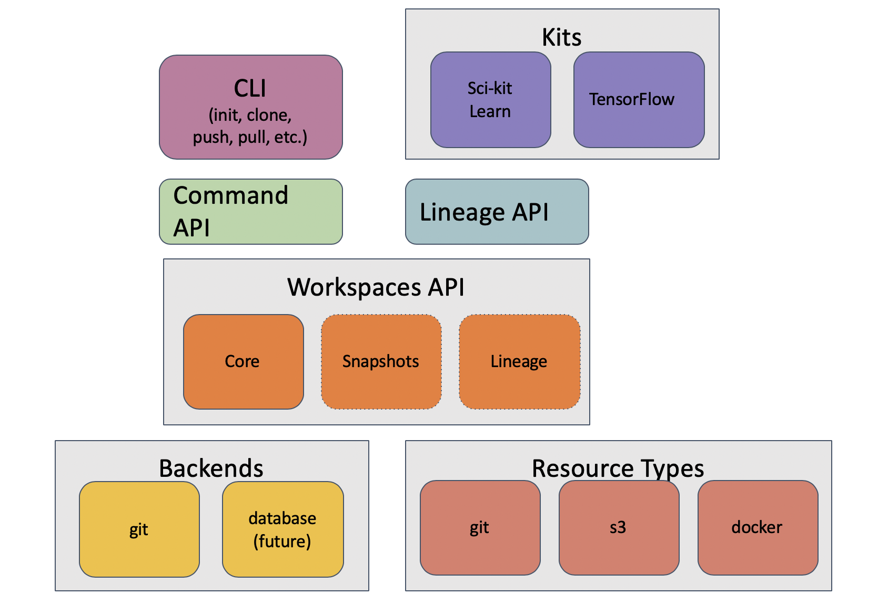

.. _internals:

7. Internals: Developer's Guide
===============================
This section is a guide for people working on the development of Data Workspaces
or people who which to extend it (e.g. through their own resource types or
kits).

Installation and setup for development
--------------------------------------
In summary:

1. Install Python 3 via the Anaconda distribution.
2. Make sure you have the ``git`` and ``make`` utilties on your system.
3. Create a virtual environment called ``dws`` and activate it.
4. Install ``mypy`` via ``pip``.
5. Clone the main ``data-workspaces-python`` repo.
6. Install the ``dataworkpaces`` package into your virtual environment.
7. Download and configure ``rclone``.
8. Run the tests.

Here are the details:

We recommend using `Anaconda3 <https://www.anaconda.com/distribution/>`_
for development, as it can be easily installed on Mac and Linux and includes
most of the packages you will need for development and data science projects.
You will also need some basic system utilities: ``git`` and ``make`` (which may
already be installed).

Once you have Anaconda3 installed, create a virtual environment for your
work::

  conda create --name dws

To activate the environment::

  conda activate dws

You will need the `mypy <https://mypy.readthedocs.io/en/latest/>`_
type checker, which is run as part of the tests.
It is best to install via pip to get the latest version (some older versions
may be buggy). Once you have activated your environment, ``mypy`` may be installed
as follows::

  pip install mypy

Next, clone the Data Workspaces main source tree::

  git clone git@github.com:data-workspaces/data-workspaces-core.git

Now, we install the data workspaces library, via ``pip``, using an editable
mode so that our source tree changes are immediately visible::

  cd data-workspaces-core
  pip install --editable `pwd`

With this setup, you should not have to configure ``PYTHONPATH``.

Next, we install ``rclone``, a file copying utility used by the *rclone resource*.
You can download the latest ``rclone`` executable from http://rclone.org. Just make
sure that the executable is available in your executable path. Alternatively,
on Linux, you can install ``rclone`` via your system's package manager. To
configure ``rclone``, see the instructions :ref:`here <rclone_config>` in the
Resource Reference.

Now, you should be ready to run the tests::

  cd tests
  make test

The tests will print a lot to the console. If all goes well, it should
end with something like this::

  ----------------------------------------------------------------------
  Ran 40 tests in 23.664s

  OK

Overall Design
--------------
Here is a block diagram of the system architecture:

The core of the system is the Workspaces API, which is located in
``dataworkspaces/workspace.py``. This API provides a base ``Workspace`` classes for
the workspace and a base ``Resource`` class for resources. There are also several
mixin classes which define extensions to the basic functionality. See
:ref:`Core Workspace and Resource API <workspace_api>` for details.

The ``Workspace`` class has one or more *backends* which implement the
storage and management of the workspace metadata. Currently, there is only
one complete backend, the *git* backend, which stores its metadata in
a git repository.

Independent of the workspace backend are *resource types*, which provide
concrete implementations of the the ``Resource`` base class. These currently include
resource types for git, git subdirectories, rclone, and local files.

Above the workspace API sits the *Command API*, which implements command functions
for operations like init, clone, push, pull, snapshot and restore. There is a thin layer above this for programmatic access (``dataworkspaces.api``) as well as a full
command line interface, implmented using the
`click <https://click.palletsprojects.com/en/7.x/>`_ package
(see ``dataworkspaces.dws``).

The *Lineage API* is also implemented on top of the basic workspace interface and
provides a way for pipeline steps to record their inputs, outputs, and code
dependencies.

Finally, *kits* provide integration with user-facing libraries and applications,
such as Scikit-learn and Jupyter notebooks.

Code Layout
~~~~~~~~~~~
The code is organized as follows:

  * ``dataworkspaces/``

    * ``api.py`` - API to run a subset of the workspace commands from Python.
      This is useful for building integrations.
    * ``dws.py`` - the command line interface
    * ``errors.py`` - common exception class definitions
    * ``lineage.py`` - the generic lineage api
    * ``workspace.py`` - the core api for workspaces and resources
    * ``backends/`` - implementations of workspace backends
    * ``utils/`` - lower level utilities used by the upper layers
    * ``resources/`` - implementations of the resource types
    * ``commands/`` - implementations of the individual dws commands
    * ``third_party/`` - third-party code (e.g. git-fat)
    * ``kits/`` - adapters to specific external technologies

Git Database Layout
~~~~~~~~~~~~~~~~~~~
When using the *git backend*, a data workspace is contained within a Git repository.
The metadata about resources,
snapshots and lineage is stored in the subdirectory ``.dataworkspace``. The various
resources can be other subdirectories of the workspace's repository or may be
external to the main Git repo.

The layout for the files under the ``.dataworkspace`` directory is as follows:

  * ``.dataworkspace/``

    * ``config.json`` - overall configuration (e.g. workspace name, global params)
    * ``local_params.json`` - local parameters (e.g. hostname); not checked into git
    * ``resources.json`` - lists all resources and their config parameters
    * ``resource_local_params.json`` - configuration for resources that is local to
      this machine (e.g. path to the resource); not checked into git
    * ``current_lineage/`` - contains lineage files reflecting current state of each
      resource; not checked into git
    * ``file/`` - contains metadata for *local files* based resources; in particular,
      has the file-level hash information for snapshots
    * ``snapshots/`` - snapshot metadata

      * ``snapshot-<HASHCODE>.json`` - lists the hashes for each resource in the
        snapshot. The hash of this file is the hash of the overall snapshot.
      * ``snapshot_history.json`` - metadata for the past snapshots

    * ``snapshot_lineage/`` - contains lineage data for past snapshots

      * ``<HASHCODE>/`` - directory containing the current lineage files at
        the time of the snapshot associated with the hashcode.
        Unlike ``current_lineeage``, this is checked into git.

In designing the workspace database, we try to follow the following
guidelines:

1. Use JSON as our file format where possible - it is human readable and editable
   and easy to work with from within Python.
2. Local or uncommitted state is not stored in Git (we use .gitignore to keep
   the files outside of the repo). Such files are initialized by ``dws init``
   and ``dws clone``.
3. Avoid git merge conflicts by storing data in seperate files where possible.
   For example, the resources.json file should really be broken up into
   one file per resource, stored under a common directory (see issue #13).
4. Use git's design as an inspiration. It provides an efficient and flexible
   representation.

    
Command Design
--------------
The bulk of the work for each command is done by the core Workspace API
and its backends. The command fuction itself (``dataworkspaces.commands.COMMAND_NAME``)
performs parameter-checking, calls the associated parts of Workspace API,
and handles user interactions when needed.

Resource Design
---------------
Resources are orthoginal to commands and represent the collections of
files to be versioned.

A resource may have one of four roles:

1. **Source Data Set** - this should be treated read-only by the ML
   pipeline. Source data sets can be versioned.
2. **Intermediate Data** - derived data created from the source data set(s)
   via one or more data pipeline stages.
3. **Results** - the outputs of the machine learning / data science process.
4. **Code** - code used to create the intermediate data and results, typically
   in a git repository or Docker container.

The treatment of resources may vary based on the role. We now look at
resource functionality per role.

Source Data Sets
~~~~~~~~~~~~~~~~
We want the ability to name source data sets and swap them in and out without
changing other parts of the workspace. This still needs to be implemented.

Intermediate Data
~~~~~~~~~~~~~~~~~~
For intermediate data, we may want to delete it from the current state of
the workspace if it becomes out of date (e.g. a data source version is changed
or swapped out). This still needs to be implemented.

Results
~~~~~~~
In general, results should be additive.

For the ``snapshot`` command, we move the results to a specific subdirectory per
snapshot. The name of this subdirectory is determined by a template that can
be changed by setting the parameter ``results.subdir``. By default, the template
is: ``{DAY}/{DATE_TIME}-{USER}-{TAG}``. The moving of files is accomplished via the
method ``results_move_current_files(rel_path, exclude)`` on the `Resource <resources>`
class. The ``snapshot()`` method of the resource is still called as usual, after
the result files have been moved.

Individual files may be excluded from being moved to a subdirectory. This is done
through a configuration command. Need to think about where this would be stored --
in the resources.json file? The files would be passed in the exclude set to
``results_move_current_files``.

If we run ``restore`` to revert the workspace to an
older state, we should not revert the results database. It should always
be kept at the latest version. This is done by always putting results
resources into the leave set, as if specified in the ``--leave`` option.
If the user puts a results resource in the ``--only`` set, we will error
out for now.

.. _integration_api:

Integration API
---------------
The module ``dataworkspaces.api`` provides a simplified, high level programmatic
inferface to Data Workspaces. It is for integration with third-party tooling.

.. automodule:: dataworkspaces.api
   :no-undoc-members:
   :members:

.. _workspace_api:

Core Workspace API
------------------
Here is the detailed documentation for the Core Workspace API, found in
``dataworkspaces.workspace``.

.. automodule:: dataworkspaces.workspace
   :no-undoc-members:

Core Classes
~~~~~~~~~~~~
.. autoclass:: Workspace
   :members:
   :undoc-members:

.. autoclass:: ResourceRoles
   :members:
   :undoc-members:

.. autoclass:: Resource
   :members:
   :undoc-members:

.. autodata:: RESOURCE_ROLE_CHOICES

Factory Classes and Functions
~~~~~~~~~~~~~~~~~~~~~~~~~~~~~

.. autoclass:: WorkspaceFactory
   :members:
   :no-undoc-members:

.. autofunction:: load_workspace

.. autofunction:: find_and_load_workspace

.. autofunction:: init_workspace

.. autoclass:: ResourceFactory
   :members:
   :no-undoc-members:

Mixins for Files and Local State
~~~~~~~~~~~~~~~~~~~~~~~~~~~~~~~~

.. autoclass:: FileResourceMixin
   :members:
   :undoc-members:

.. autoclass:: LocalStateResourceMixin
   :members:
   :undoc-members:

Mixins for Synchronized and Centralized Workspaces
~~~~~~~~~~~~~~~~~~~~~~~~~~~~~~~~~~~~~~~~~~~~~~~~~~
Workspace backends should inherit from one of either
:class:`SyncedWorkspaceMixin` or :class:`CentralWorkspaceMixin`.

.. autoclass:: SyncedWorkspaceMixin
   :members:
   :undoc-members:

.. autoclass:: CentralWorkspaceMixin
   :members:
   :undoc-members:

Mixins for Snapshot Functionality
~~~~~~~~~~~~~~~~~~~~~~~~~~~~~~~~~
To support snapshots, the interfaces defined by
:class:`SnapshotWorkspaceMixin` and :class:`SnapshotResourceMixin` should
be implmented by workspace backends and resources, respectively.
:class:`SnapshotMetadata` defines the metadata to be stored for each
snapshot.

.. autoclass:: SnapshotMetadata
   :members:
   :undoc-members:

.. autoclass:: SnapshotWorkspaceMixin
   :members:
   :undoc-members:

.. autoclass:: SnapshotResourceMixin
   :members:
   :undoc-members:

