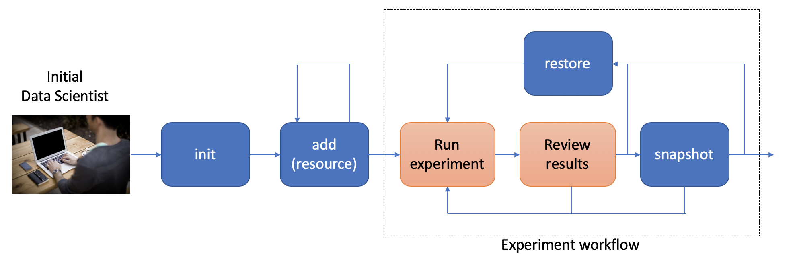
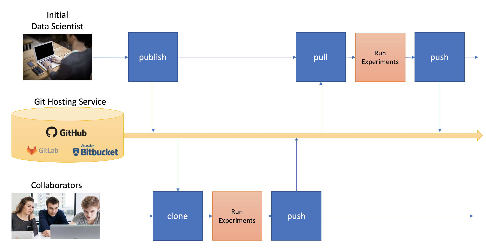

.. _intro:

1. Introduction
===============
.. _quickstart:

Quick Start
-----------
Here is a quick example to give you a flavor of the project, using
`scikit-learn <https://scikit-learn.org>`_
and the famous digits dataset running in a Jupyter Notebook.

First, install [#introf1]_ the libary::

  pip install dataworkspaces

Now, we will create a workspace::

  mkdir quickstart
  cd ./quickstart
  dws init --create-resources code,results

This created our *workspace* (which is a git repository under the covers)
and initialized it with two subdirectories,
one for the source code, and one for the results. These are special
subdirectories, in that they are *resources* which can be tracked and versioned
independently.

.. [#introf1] See the :ref:`Installation section <installation>` for more options and details.

Now, we are going to add our source data to the workspace. This resides in an
external, third-party git repository. It is simple to add::

  git clone https://github.com/jfischer/sklearn-digits-dataset.git
  dws add git --role=source-data ./sklearn-digits-dataset

Now, we can create a Jupyter notebook for running our experiments::

  cd ./code
  jupyter notebook

This will bring up the Jupyter app in your brower. Click on the *New*
dropdown (on the right side) and select "Python 3". Once in the notebook,
click on the current title ("Untitled", at the top, next to "Jupyter")
and change the title to ``digits-svc``.

Now, type the following Python code in the first cell::

  import numpy as np
  from os.path import join
  from sklearn.svm import SVC
  from dataworkspaces.kits.scikit_learn import train_and_predict_with_cv
  
  DATA_DIR='../sklearn-digits-dataset'
  RESULTS_DIR='../results'
  
  data = np.loadtxt(join(DATA_DIR, 'data.csv'), delimiter=',')
  target = np.loadtxt(join(DATA_DIR, 'target.csv'), delimiter=',')
  train_and_predict_with_cv(SVC, {'gamma':[0.01, 0.001, 0.0001]}, data, target,
                            DATA_DIR, RESULTS_DIR, random_state=42)

Now, run the cell. It will take a few seconds to train and test the
model. You should then see::

  Best params were: {'gamma': 0.001}
  accuracy: 0.99
  classification report:
                precision    recall  f1-score   support
  
           0.0       1.00      1.00      1.00        33
           1.0       1.00      1.00      1.00        28
           2.0       1.00      1.00      1.00        33
           3.0       1.00      0.97      0.99        34
           4.0       1.00      1.00      1.00        46
           5.0       0.98      0.98      0.98        47
           6.0       0.97      1.00      0.99        35
           7.0       0.97      0.97      0.97        34
           8.0       1.00      1.00      1.00        30
           9.0       0.97      0.97      0.97        40
  
     micro avg       0.99      0.99      0.99       360
     macro avg       0.99      0.99      0.99       360
  weighted avg       0.99      0.99      0.99       360
  
  Wrote results to results:results.json

Now, you can save and shut down your notebook. If you look at the
directory ``quickstart/results``, you should see a ``results.json``
file with information about your run.

Next, let us take a *snapshot*, which will record the state of
the workspace and save the data lineage along with our results::

  dws snapshot -m "first run with SVC" SVC-1

``SVC-1`` is the *tag* of our snapshot.
If you look in ``quickstart/results``, you will see that the results
(currently just ``results.json``) have been moved to the subdirectory
``snapshots/HOSTNAME-SVC-1``, where ``HOSTNAME`` is the hostname for your
local machine). A file, ``lineage.json``, containing a full
data lineage graph for our experiment has also been
created in that directory.

Some things you can do from here:

* Run more experiments and save their results by snapshotting the workspace.
  If, at some point, we want to go back to our first experiment, we can run:
  ``dws restore SVC-1``. This will restore the state of the source data and
  code subdirectories, but leave the full history of the results.
* Upload your workspace on GitHub or an any other Git hosting application.
  This can be to have a backup copy or to share with others.
  Others can download it via ``dws clone``.
* More complex scenarios involving multi-step data pipelines can easily
  be automated. See the documentation for details.

.. _installation:

Installation
------------
Now, let us look into more detail at the options for installation.

Prerequisites
~~~~~~~~~~~~~
This software runs directly on Linux and MacOSx. Windows is supported by via the
`Windows Subsystem for Linux <https://docs.microsoft.com/en-us/windows/wsl/install-win10>`_. The following software should be pre-installed:

* git
* Python 3.5 or later
* Optionally, the `rclone <https://rclone.org>`_ utility, if you are going to be
  using it to sync with a remote copy of your data.

Installation from the Python Package Index (PyPi)
~~~~~~~~~~~~~~~~~~~~~~~~~~~~~~~~~~~~~~~~~~~~~~~~~
This is the easiest way to install Data Workspaces is via
the Python Package Index at http://pypi.org.

We recommend first creating a
`virtual environment <https://docs.python.org/3/library/venv.html#venv-def>`_
to contain the Data Workspaces software and any other software needed for your
project. Using the standard Python 3 distribution, you can create and *activate*
a virtual environment via::

  python3 -m venv VIRTUAL_ENVIRONMENT_PATH
  source VIRTUAL_ENVIRONMENT_PATH/bin/activate

If you are using the `Anaconda <https://www.anaconda.com/distribution/>`_
distribution of Python 3, you can create and activate a virtual environment via::

  conda create --name VIRTUAL_ENVIRONMENT_NAME
  conda activate VIRTUAL_ENVIRONMENT_NAME

Now that you have your virtual environment set up, we can install the actual library::

  pip install dataworkspaces

To verify that it was installed correctly, run::

  dws --help

Installation via the source tree
~~~~~~~~~~~~~~~~~~~~~~~~~~~~~~~~
You can clone the source tree and install it as follows::

  git clone git@github.com:data-workspaces/data-workspaces-core.git
  cd data-workspaces-python
  pip install `pwd`
  dws --help # just a sanity check that it was installed correctly

Concepts
--------
Data Workspaces provides a thin layer of the Git version control
system for easy management of source data, intermediate data, and results for
data science projects. A *workspace* is a Git repository with some added
metadata to track external resources and experiment history. You can create
and manipulate workspaces via ``dws``, a command line tool. There is
also a programmatic API for integrating more tightly with your data
pipeline.

A workspace contains one or more *resources*. Each resource represents
a collection of data that has a particular *role* in the project -- source
data, intermediate data (generated by processing the original source data),
code, and results. Resources can be subdirectories in the workspace's
Git repository, separate git repositories, local directories, or remote
systems (e.g. an S3 bucket or a remote server's files accessed via ssh).

Once the assets of a data science project have been organized into
resources, one can do the work of developing the associated software and
running experiments. At any point in time, you can take a *snapshot*, which
captures the current state of all the resources referenced by the workspace.
If you want to go back to a prior state of the workspace or even an individual
resource, you can *restore* back to any prior snapshot.

*Results resources* are handled a little differently than other types: they
are always additive. Each snapshot of a results resource takes the current files
in the resource and moves it to a snapshot-specific subdirectory. This lets you
view and compare the results of all your prior experiments.

You interact with your data workspace through the ``dws`` command line tool,
which like Git, has various subcommands for the actions you might take
(e.g. creating a new snapshot, syncing with a remote repository, etc.).

Beyond the basic versioning of your project through snapshots, you can use
the :ref:`Lineage API <lineage>` to track each step of your workflow, including inputs/outputs,
parameters, and metrics (accuracy, loss, precision, recall, roc, etc.). This lineage data is
saved with your snapshots so you can understand how you arrived at each
of your results.

Commmand Line Interface
-----------------------
To run the command line interface, you use the ``dws`` command,
which should have been installed into your environment by ``pip install``.
``dws`` operations have the form::

    dws [GLOBAL_OPTIONS] COMMAND [COMMAND_OPTIONS] [COMMAND_ARGS]

Just run ``dws --help`` for a list of global options and commands.

Commands
~~~~~~~~
Here is a summary of the key commands:

* ``init`` - initialize a new workspace in the current directory
* ``add`` - add a *resource* (a git repo, a directory, an s3 bucket, etc.)
  to the current workspace
* ``snapshot`` - take a snapshot of the current state of the workspace
* ``restore`` - restore the state to a prior snapshot
* ``push`` - push a workspace and all resources to their (remote) origins
* ``pull`` - pull the workspace and all resources from their (remote) origins
* ``clone`` - clone a workspace and all the associated resources to the local machine
* ``run`` - run a command and capture the lineage. This information is saved in a file for
  future calls to the same command. *(not yet implemented)*

See the :ref:`Command Reference <commands>` section for a full description of
all commands and their options.

Workflow
~~~~~~~~
To put these commands in context, here is a typical workflow for the
initial data scientist on a project:

The person starting the project creates a new workspace on their local machine
using the ``init`` command. Next, they need to tell the data workspace about
their code, data sets, and places where they will store intermediate data and
results. If subdirectories of the main workspace are sufficient, they
can do this as a part of the ``init`` command, using the ``--create-resources``
option. Otherwise, they use the ``add``
command to define each *resource* associated with their project.

The data scientist can now run their experiements. This is typically an
iterative process, represented in the picture by the dashed box labeled
"Experiment Workflow". Once they have finished a complete experiment, then can use the
``snapshot`` command to capture the state of their workspace.
They can go back and run further experiments, taking a snapshot each time they
have something interesting. They can also go back to a prior state using the
``restore`` command.

Collaboration
.............
At some point, the data scientist will want to copy their project to a remote
service for sharing (and backup). Data Workspaces can use any Git hosting
service for this (e.g. GitHub, GitLab, or BitBucket) and does not need any
special setup. Here is an overview of collaborations
facilitated by Data Workspaces:

First, the data scientist creates an empty git repository
on the remote origin (e.g. GitHub, GitLab, or BitBucket) and then runs the ``push`` command to update
the origin with the full history of the workspace.

A new collaborator can use the ``clone`` command to copy the workspace down to
their local machine. They can then run experiments and take snapshots, just
like the original data scientisst. When readly, then can upload their changes to the via the ``push`` command.
Others can then use the ``pull`` command to download these changes to their workspace.
This process can be repeated as many times as necessary, and multiple collaborators can overlap
their work.
