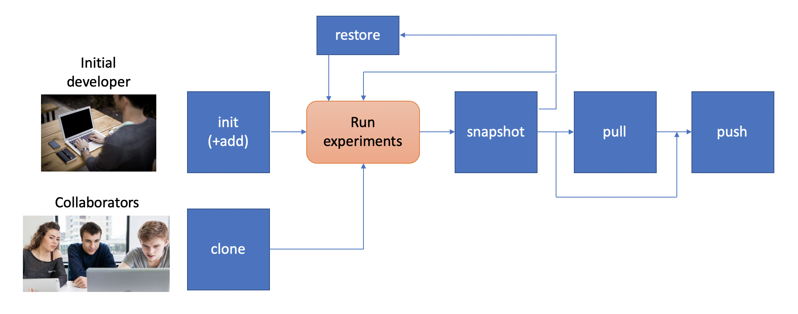

.. _intro:

1. Introduction
===============
Concepts
--------
Data Workspaces provides a thin layer of the Git version control
system for easy management of source data, intermediate data, and results for
data science projects. A *workspace* is a Git repository with some added
metadata to track external resources and experiment history. You can create
and manipulate workspaces via ``dws``, a command line tool. There is
also a programmatic API for integrating more tightly with your data
pipeline.

A workspace contains one or more *resources*. Each resource represents
a collection of data that has a particular *role* in the project -- source
data, intermediate data (generated by processinng the original source data),
code, and results. Resources can be subdirectories in the workspace's
Git repository, separate git repositories, local directories, or remote
systems (e.g. an S3 bucket or a remote server's files accessed via ssh).

Once the assets of a data science project have been organized into
resources, one can do the work of developing the associated software and
running experiments. At any point in time, you can take a *snapshot*, which
captures the current state of all the resources referenced by the workspace.
If you want to go back to a prior state of the workspace or even an individual
resource, you can *restore* back to any prior snapshot.

*Results resources* are handled a little differently than other types: they
are always additive. Each snapshot of a results resource takes the current files
in the resource and moves it to a snapshot-specific subdirectory. This lets you
view and compare the results of all your prior experiements.

Building on Git, a data workspace can be synced with a remote copy, called the *origin*.
The data workspace command line tool, ``dws``, provides ``push`` and ``pull`` commands,
similar to their Git analogs. In addition to the workspace itself, these commands can sync
all the resources referenced by the workspace. Finally, there is a ``clone`` command which can initialize
your environment on a new machine.

Taken together, these features let you:

1. Track and version all the different resources for your data science project
   from one place.
2. Automatically track the full history of your experimental results. Scripts can easily be
   developed to build reports on these results.
3. Reproduce any prior experiment, including the source data, code, and configuration parameters used.
4. Go back to a prior experiment as a "branching-off" point to explore additional permuations.
5. Collaborate with others on the same project, sharing data, code, and results.
6. Easily reproduce your environment on a new machine to parallelize work.
7. Publish your environment on a site like GitHub or GitLab for others to download and explore.

Installation
------------
Rerequisites
~~~~~~~~~~~~
This software runs directly on Linux and MacOSx. Windows is supported by via the
`Windows Subsystem for Linux <https://docs.microsoft.com/en-us/windows/wsl/install-win10>`_. The following software should be pre-installed:

* git
* Python 3.5 or later
* Optionally, the `rclone <https://rclone.org>`_ utility, if you are going to be
  using it to sync with a remote copy of your data.

Installation via pip
~~~~~~~~~~~~~~~~~~~~
TODO

Installation via the source tree
~~~~~~~~~~~~~~~~~~~~~~~~~~~~~~~~
You can clone the source tree and install it as follows::

  git clone git@github.com:jfischer/data-workspaces-python.git
  cd data-workspaces-python
  pip install `pwd`

Commmand Line Inteface
----------------------
To run the command line interface, you use the ``dws`` command,
which should have been installed into your environment by ``pip install``.
``dws`` operations have the form::

    dws [GLOBAL_OPTIONS] SUBCOMMAND [SUBCOMMAND_OPTIONS] [SUBCOMMAND_ARGS]

Just run ``dws --help`` for a list of global options and subcommands.

Subcommands
~~~~~~~~~~~
Here is a summary of the key subcommands:

* ``init`` - initialize a new workspace in the current directory
* ``add`` - add a *resource* (a git repo, a directory, an s3 bucket, etc.)
  to the current workspace
* ``snapshot`` - take a snapshot of the current state of the workspace
* ``restore`` - restore the state to a prior snapshot
* ``push`` - push a workspace and all resources to their (remote) origins
* ``pull`` - pull the workspace and all resources from their (remote) origins
* ``clone`` - clone a workspace and all the associated resources to the local machine
* ``run`` - run a command and capture the lineage. This information is saved in a file for
  future calls to the same command. *(not yet implemented)*

Workflow
~~~~~~~~
To put these subcommands in context, here is a typical workflow for a project:

The person starting the project creates a new workspace on their local machine
using the ``init`` command. If they picked a standard project template, they may
already have all the resources they need defined Otherwise, they use the ``add``
command to tell the data workspace about their code, data sets, and places where
they will store intermediate data and results. They can now start running their
experiments. Once they have finished a complete experiment, then can use the
``snapshot`` command to capture the state of their workspace.

They can go back and run further experiments, taking a snapshot each time they
have something interesting. They can also go back to a prior state using the
``restore`` command.

At some point, the original developer will want to copy their project to a remote
service for sharing (and backup). To do this, they create an empty git repository
on the remote origin (e.g. GitHub) and then run the ``push`` command to update
the origin with the full history of the workspace.

A new collaborator can use the ``clone`` command to copy the workspace down to
their local machine. They can then run experiments and take snapshots, just
like the original developer. Then can download changes from the origin via
the ``pull`` comand and add upload their changes via the ``push`` command.
