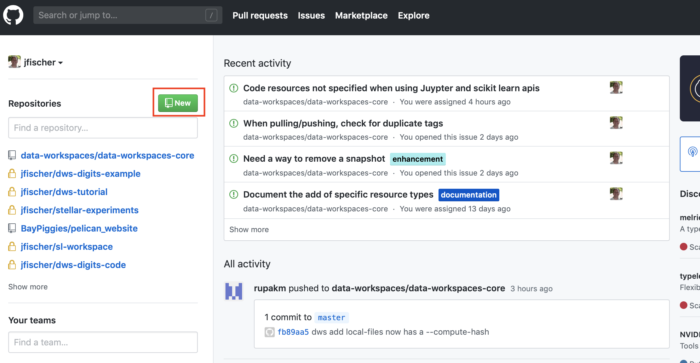
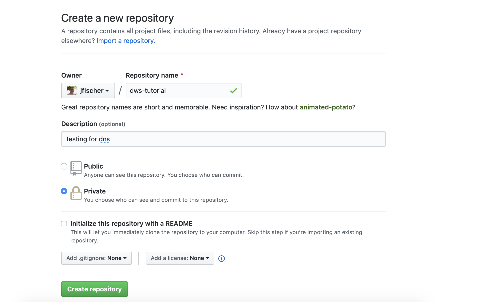
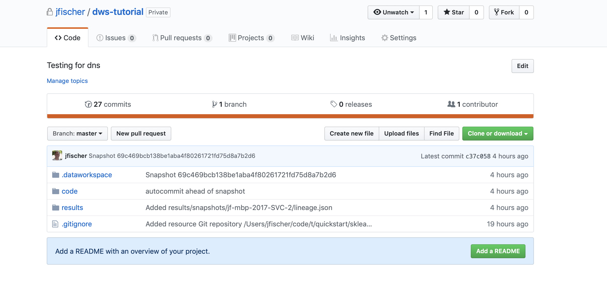
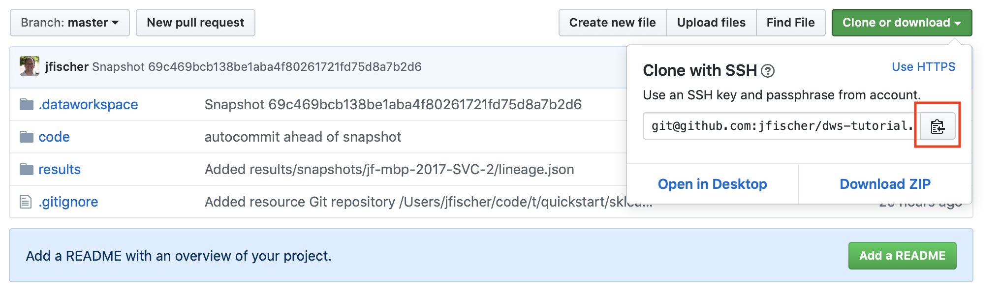

.. _tutorial:

2. Tutorial
===========
Let's build on the :ref:`Quick Start <quickstart>`.  If you haven't already, run
through it so that you have a ``quickstart`` workspace with one tag (``SVC-1``).

Status Command
--------------
We can check the status and history of our workspace with the ``dws status --history``
command::

  $ dws status --history
  Role source-data
  ----------------
    git repo sklearn-digits-dataset
  Role intermediate-data
  ----------------------
    No items with role intermediate-data
  Role code
  ---------
    git subdirectory code
  Role results
  ------------
    git subdirectory results
  
  History of snapshots
  Hash     Tags                 Created             Metric             Value        Message
  5ac8708  SVC-1                2019-04-13T16:47:28 accuracy           0.989        first run wih SVC
  Showing 1 of 1 snapshots
  Have now successfully shown the current status

Further Experiments
-------------------
Now, let's try to use Logistic Regression. Create a new Jupyter notebook called
``digits-lr`` in the ``code`` subdirectory of ``quickstart``. Enter the following
code into a notebook cell::

  import numpy as np
  from os.path import join
  from sklearn.linear_model import LogisticRegression
  from dataworkspaces.kits.scikit_learn import train_and_predict_with_cv
  
  DATA_DIR='../sklearn-digits-dataset'
  RESULTS_DIR='../results'
  
  data = np.loadtxt(join(DATA_DIR, 'data.csv'), delimiter=',')
  target = np.loadtxt(join(DATA_DIR, 'target.csv'), delimiter=',')
  train_and_predict_with_cv(LogisticRegression,
                            {'C':[1e-3, 1e-2, 1e-1, 1, 1e2], 'solver':['lbfgs'],
                             'multi_class':['multinomial']},
                            data, target,
                            DATA_DIR, RESULTS_DIR, random_state=42)

Note the only differences in our call to ``train_and_predict_with_cv`` are that
we pass a different classifier (``LogisticRegression``) and a ``param_grid``
with parameters appropriate to that classifier. If you run this cell,
you should see several no-convergence warnings (some of the values for ``C``
must be bad for this data set) and then a final result::

  Best params were: {'C': 0.01, 'multi_class': 'multinomial', 'solver': 'lbfgs'}
  accuracy: 0.97
  classification report:
                precision    recall  f1-score   support
  
           0.0       1.00      1.00      1.00        33
           1.0       0.97      1.00      0.98        28
           2.0       0.97      1.00      0.99        33
           3.0       1.00      0.97      0.99        34
           4.0       1.00      0.98      0.99        46
           5.0       0.94      0.94      0.94        47
           6.0       0.97      0.97      0.97        35
           7.0       1.00      0.97      0.99        34
           8.0       0.97      0.97      0.97        30
           9.0       0.95      0.97      0.96        40
  
     micro avg       0.97      0.97      0.97       360
     macro avg       0.98      0.98      0.98       360
  weighted avg       0.98      0.97      0.98       360
  
  Wrote results to results:results.json

Ok, so our Logistic Regression
accuracy of 0.97 is not as good as we obtained from the
Support Vector Classifier (0.989). Let's take a snapshot anyway,
so we have this experiment for future reference. Maybe someone will
ask us, "Did you try Logistic Regession?", and we can show them
the full results and even use a ``restore`` command to re-run the
experiment for them. Here's how to take the snapshot::

  dws snapshot -m "Logistic Regession experiment" LR-1

Saving a trained model
----------------------
Since the Support Vector Classifier gave the best results, let us train
a model with the full data set and save it to our results directory.
``train_and_predict_with_cv`` can do that for us if we specify the
``model_name`` parameter. Start the ``digits-svc`` notebook and add
``model_name='svc-best'`` to the call as follows::

  train_and_predict_with_cv(SVC, {'gamma':[0.01, 0.001, 0.0001]}, data, target,
                            DATA_DIR, RESULTS_DIR, random_state=42,
                            model_name='svc-best')

Now, run the cell. It should print the metrics as before and then the message:
"Wrote trained model to /path/to/results/svc-best.pkl". Save and quit
the notebook. From the ``code`` directory, let's run an ``ls`` command to see
what was generated::

  $ ls ../results
  README.txt	results.json	snapshots	svc-best.pkl

We see that the results.json file was generated as before and we have a new
file, ``svc-best.pkl``, which contains the pickled model. Let's now take a
snapshot: ``dws snapshot -m "trained the best model (SVC)" SVC-2``. If we
run the status command we can see the history of our experiments::

  dws status --history
  Role source-data
  ----------------
    git repo sklearn-digits-dataset
  Role intermediate-data
  ----------------------
    No items with role intermediate-data
  Role code
  ---------
    git subdirectory code
  Role results
  ------------
    git subdirectory results
  
  History of snapshots
  Hash     Tags                 Created             Metric             Value        Message
  69c469b  SVC-2                2019-04-14T08:05:17 accuracy           0.989        trained the best model (SVC)
  ce702b1  LR-1                 2019-04-14T07:37:24 accuracy           0.975        Logistic Regession experiment
  5ac8708  SVC-1                2019-04-13T16:47:28 accuracy           0.989        first run wih SVC
  Showing 3 of 3 snapshots

Publishing a workspace
----------------------
Now, we will publish our workspace on `GitHub <https://github.com>`_. A
similar approach can be taken for other code hosting services like BitBucket
or GitLab.

The first few steps are GitHub-specific, but the ``dws`` commands will work
across all hosting services.

First, create an account on GitHub if you do not already have one. Next,
go to your front page on GitHub and click on the green new repository button
on the left side of the page:

You should now get a dialog like this:

Fill in a name for your repository (in this case, ``dws-tutorial``) and
select whether you want it to be public (visible to the work) or
private (only visible to those you explicitly grant access). You
won't need a README file, .gitignore, or license file, as we will be
initializing the repository from your local copy. Go ahead and click
on the "Create Repository" button.

Now, back on the command line,
go to the directory containing the ``quickstart`` workspace on your
local machine. Run the following commands replacing ``YOUR_USERNAME``
with your GitHub username::

  git remote add origin git@github.com:YOUR_USERNAME/dws-tutorial.git
  git push -u origin master

You have pushed the workspace's state to your GitHub Repository. [#tut1]_

At this point, if you refresh the page for this repository on GitHub, you should see
something like this:

You have successfully published your workspace!

.. [#tut1] If the workspace contained updates to external git repositories or other
   resources, we would also have to perform a ``dws push`` command at this point.
   We can skip it, as the only changes we made were in the ``code`` and ``results``
   resources, which are subdirectories of the main workspace.

Cloning a workspace
-------------------
Now, we want to use this workspace on a new machine (perhaps your own
or perhaps belonging to a collaborator). First, make certain that the
account on the second machine has at least read access to the repository.
If you will be pushing updates from this account, it will also need write
access to the repo. Next, make sure that your software dependencies are
installed (e.g. Jupyter, NumPy, and Scikit-learn) and then install the Data Workspaces
library into your local environment::

  pip install dataworkspaces

From a browser on your second machine, go back to the GitHub page for your
repository and click on the "Clone or download"
button. It should show you a URL for cloning via SSH. Click on the clipboard
icon to the right of the URL to copy the URL to your machine's clipboard:

Then, on your second machine, go to the directory you intend to be the parent of th
workspace (in this case ``~/workspaces``) and run the following::

  dws clone GITHUB_CLONE_URL

where ``GITHUB_CLONE_URL`` is the URL you copied to your clipboard.

It should ask you two questions:

1. The hostname you want to use to identify this machine, which defaults to
   the system hostname.
2. The path for the cloned workspace, which, in this case will default to
   ``./quickstart``, since "quickstart" was the name of the original repo.
   The default is fine.

We can now change to the workspace's directory and run the status command::

  $ cd ./quickstart
  $ dws status --history
  Role source-data
  ----------------
    git repo sklearn-digits-dataset
  Role intermediate-data
  ----------------------
    No items with role intermediate-data
  Role code
  ---------
    git subdirectory code
  Role results
  ------------
    git subdirectory results
  
  History of snapshots
  Hash     Tags                 Created             Metric             Value        Message
  69c469b  SVC-2                2019-04-14T08:05:17 accuracy           0.989        trained the best model (SVC)
  ce702b1  LR-1                 2019-04-14T07:37:24 accuracy           0.975        Logistic Regession experiment
  5ac8708  SVC-1                2019-04-13T16:47:28 accuracy           0.989        first run wih SVC
  Showing 3 of 3 snapshots

We see the full history from the original workspace!

Sharing updates
---------------
Let's re-run the Support Vector classifier evaluation on the second
machine and see if we reproduce our results. First, go to the ``code``
subdirectory in your workspace. Start the Jupyter notebook as follows::

  jupyter notebook digits-svc.ipynb

This should bring up a browser with the notebook. You should see the code
from our last experiment. Run the cell. You should get the same results as
on the first machine (0.99 accuracy). Save and shutdown the notebook.

Now, take a snapshot::

  dws snapshot -m "reproduce on second machine" SVC-3

We have tagged this snapshot with the tag ``SVC-3``. We want to push the
entire workspace to GitHub. This can be done as follows::

  dws push --skip sklearn-digits-dataset

We include ``--skip sklearn-digits-dataset`` on the command line, as we
do not have write access to that resource and want to exclude it from our
push.

After the push, the *origin* respository on GitHub has been updated with
the latest snapshot and results. We can now go back to the origin machine
where we created the workspace, and download the changes. To do so, start
up a command line window, go into the workspace's directory on the first machine,
and run::

  dws pull

After the pull, we should see the experiment we ran on the second machine::

  dws status --history
  Role source-data
  ----------------
    git repo sklearn-digits-dataset
  Role intermediate-data
  ----------------------
    No items with role intermediate-data
  Role code
  ---------
    git subdirectory code
  Role results
  ------------
    git subdirectory results
  
  History of snapshots
  Hash     Tags                 Created             Metric             Value        Message
  fbc17eb  SVC-3                2019-04-14T13:21:59 accuracy           0.989        reproduce on second machine
  69c469b  SVC-2                2019-04-14T08:05:17 accuracy           0.989        trained the best model (SVC)
  ce702b1  LR-1                 2019-04-14T07:37:24 accuracy           0.975        Logistic Regession experiment
  5ac8708  SVC-1                2019-04-13T16:47:28 accuracy           0.989        first run wih SVC
  Showing 4 of 4 snapshots
  Have now successfully shown the current status

